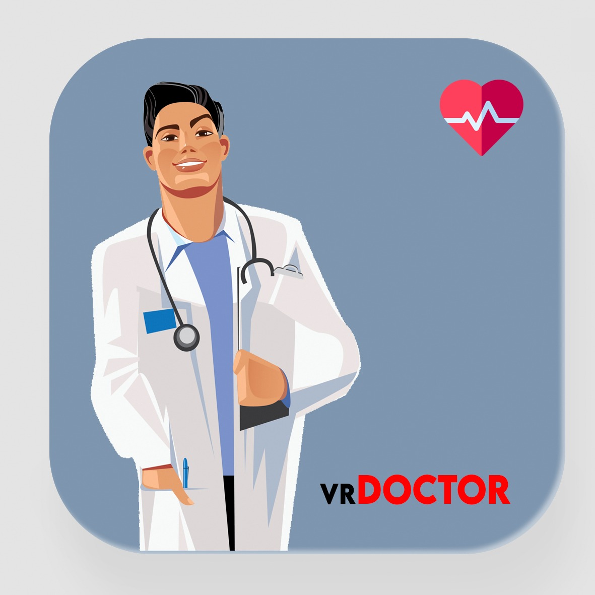

# Welcome to VR Doctor - Virtual Reality doctor consultations

  
  
  
  
  

## Description 
*This is a Virtual Reality web applicaiton that serves to provide fully immersive virtual consulations between doctors and their high risk patients, particularly those vulnerable to COVID-19 related death*

*This application was created with accessability in mind, which is why we opted to make it available on any smartphone web browser that supports WebXR. Users are only required to have a $10 mobile VR headset like Google Cardboard to set up an immersive virtual consultation with our partner doctors.*

*Our ultimate goal is to mitigate the spead of COVID-19 in hospitals and private clinics which will ultimately lead to fewer COVID related deaths. This product is  in further development as we try to improve the overall experiance.*

## Demo on how the applicaiton works
*The office scene below is a 1 minute scan of a real doctor's office created using the iPhone 12's Lidar scanner and the Polycam.ai iOS app*

*In the GIF below we use a VR emulator extension (WebXR Devive Emulator Chrome extension) to show what the user's web browser would display as they move their head around the office in VR mode*

## Features we hope to implement in the near future

* **Add voice activated model gesticulations and mouth animations to make the interaction more realistic**  
* **Move from 3D models to 360 videos to make for a more natural interaction between doctor and patient**  

Created with love using ReactJS ❤️ 

